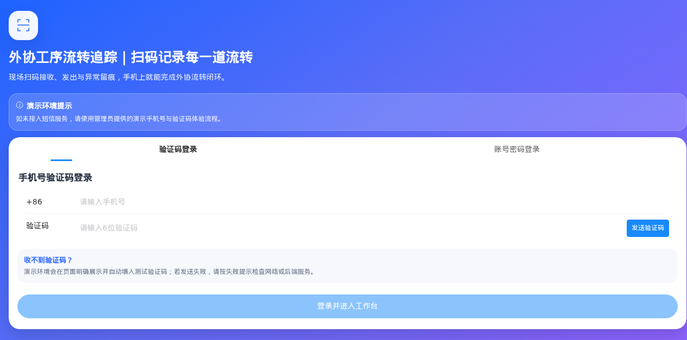
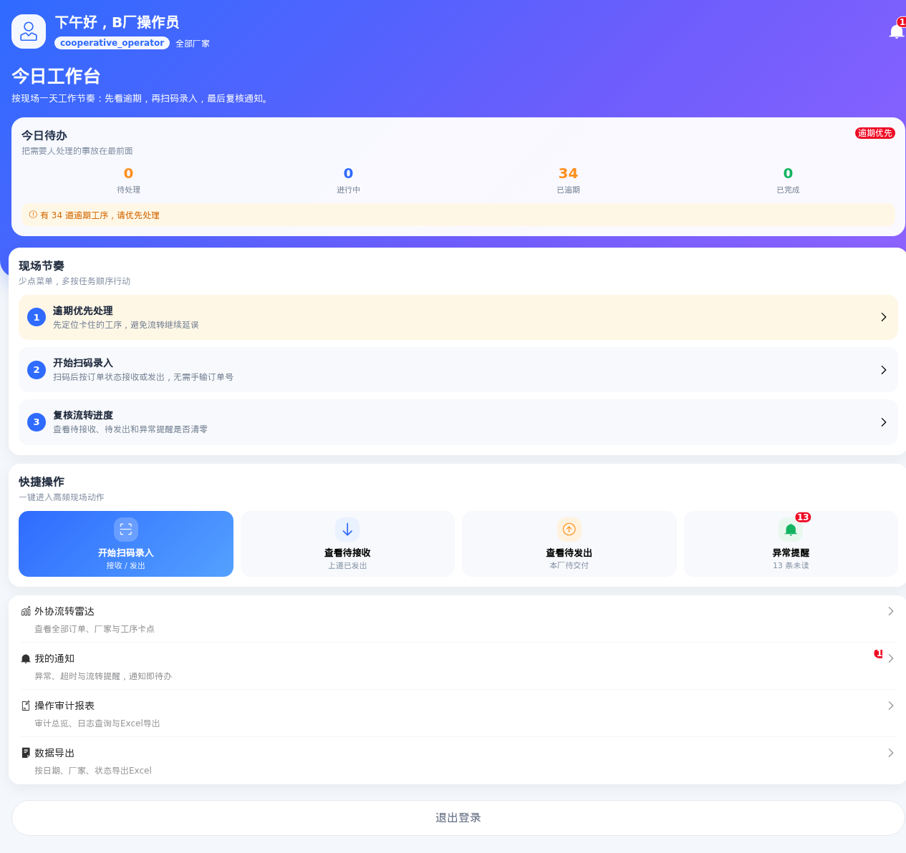
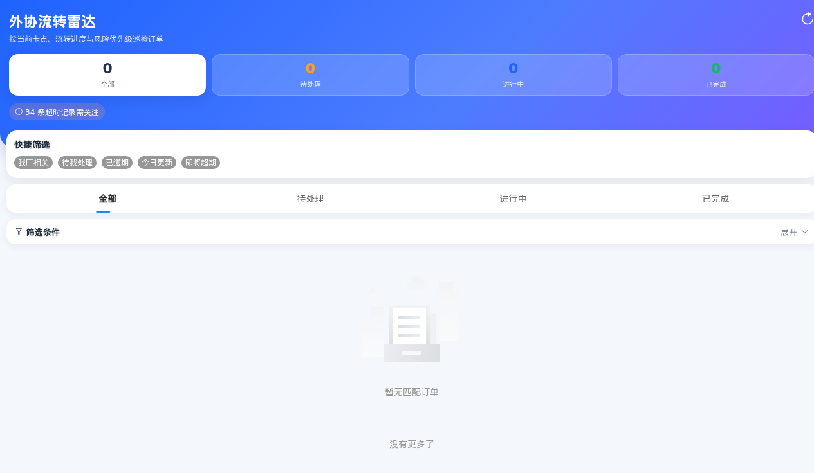
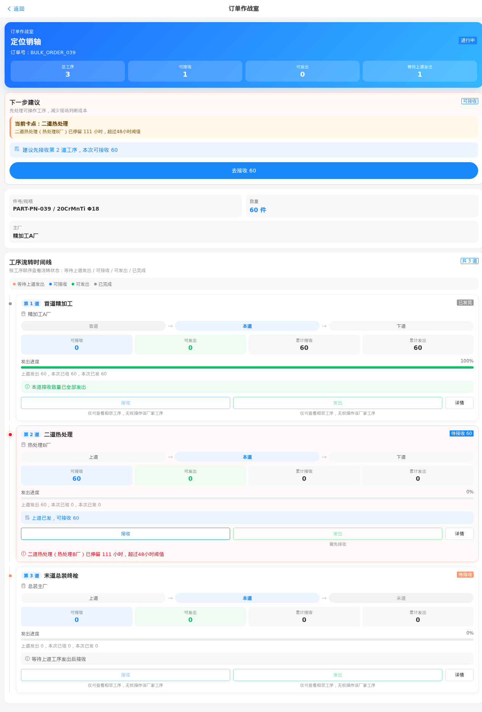
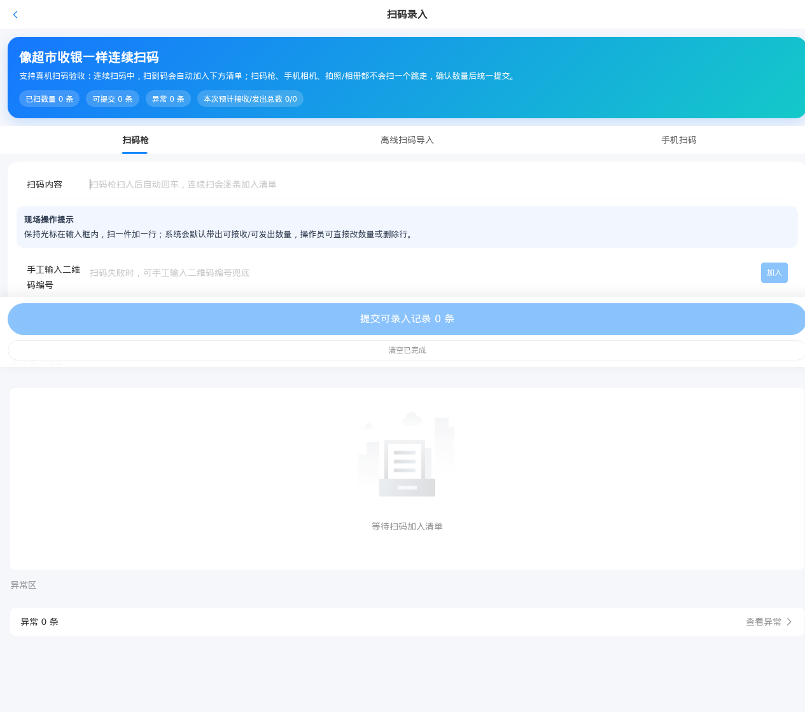

# 外协工序流转追踪系统 — 用户使用手册

**版本**：v1.0  
**日期**：2026-06-18  
**适用对象**：现场操作员、厂家管理员、企业管理员

---

## 目录
1. [快速入门](#1-快速入门)
2. [协作厂操作员操作指南](#2-协作厂操作员操作指南)
3. [主厂操作员操作指南](#3-主厂操作员操作指南)
4. [管理员操作指南](#4-管理员操作指南)
5. [按功能模块操作指南](#5-按功能模块操作指南)
6. [常见问题与解答](#6-常见问题与解答)

---

## 1. 快速入门

### 1.1 系统访问
- 访问地址：`http://您的服务器地址:8081`
- 支持浏览器：Chrome、Safari、微信内置浏览器
- 支持设备：智能手机、平板、电脑

### 1.2 首次登录
1. 打开系统地址，进入登录页

   
   
2. 选择登录方式：
   - **验证码登录**：输入手机号 → 点击"获取验证码" → 输入收到的验证码 → 点击"登录"
   - **密码登录**：切换到"密码登录"Tab → 输入用户名和密码 → 点击"登录"
3. 登录成功后自动进入首页工作台

   

> 💡 演示环境验证码统一为：`123456`

---

## 2. 协作厂操作员操作指南

### 2.1 查看本厂待接收工序
1. 登录后在首页"今日待办"区域查看
2. 或点击底部"看板"菜单，查看所有包含本厂工序的订单
3. 点击订单进入详情页，查看本厂工序状态

### 2.2 扫码接收零件
1. 点击底部"扫码"菜单，进入扫码页
2. 默认是"摄像头扫码"Tab，对准零件上的二维码
3. 扫码成功后自动加入购物车清单
4. 或切换到"手动输入"Tab，直接输入记录编号
5. 可连续扫码多个零件，全部加入清单
6. 在清单中可修改接收数量（默认是最大可接收数量）
7. 确认无误后，点击底部"提交可录入记录"按钮
8. 提交成功后，接收数量自动更新

### 2.3 扫码发出零件
流程同"扫码接收"，扫码后系统自动判断是接收还是发出操作。

### 2.4 查看流转记录
1. 在订单详情页，点击工序卡片
2. 查看该工序的累计接收、累计发出、退件数量
3. 查看操作历史和时间

### 2.5 查看系统通知
1. 点击底部"通知"菜单
2. 查看所有通知，未读通知有红点标记
3. 点击通知可跳转到对应订单
4. 点击"全部已读"可一键标记所有通知为已读

---

## 3. 主厂操作员操作指南

### 3.1 查看所有订单看板
1. 点击底部"看板"菜单
2. 查看所有订单列表，显示订单状态、数量、创建时间

   
   
3. 点击订单进入详情页，查看所有工序流转情况

   

### 3.2 识别订单卡点与风险
1. 在订单详情页，超过 48 小时未处理的工序会自动标红
2. 卡点工序显示"卡点"标记和风险等级
3. 风险等级：正常 → 提醒 → 警告 → 严重（颜色依次加深）
4. 点击卡点工序，直接进入操作页处理

### 3.3 末道工序接收与发出
同协作厂操作员扫码流程，主厂操作员可操作末道工序。

### 3.4 导出流转记录
1. 点击底部"我的"菜单
2. 进入"导出"页面
3. 选择时间范围和筛选条件
4. 点击"导出 Excel"，下载记录文件

---

## 4. 管理员操作指南

### 4.1 厂家管理
1. 登录后点击右上角头像，进入"管理后台"
2. 选择"厂家管理"
3. 可新增、编辑、禁用厂家
4. 维护厂家名称、联系人、电话

### 4.2 用户账号管理
1. 进入"管理后台" → "用户管理"
2. 可新增、编辑、禁用用户
3. 分配角色：企业管理员、厂家管理员、厂家操作员
4. 设置用户所属厂家（非管理员必填）

### 4.3 查看操作日志
1. 所有接收、发出、修改操作都有完整日志记录
2. 可按操作人、时间、操作类型筛选查询

---

## 5. 按功能模块操作指南

### 5.1 扫码录入模块
**摄像头扫码**
1. 进入扫码页，默认是"摄像头扫码"Tab

   
   
2. 第一次使用会请求摄像头权限，请点击"允许"
3. 将二维码对准取景框，自动识别
4. 识别成功后加入清单
5. 可连续扫码多个

**手动输入兜底**
1. 切换到"手动输入"Tab
2. 输入记录编号（如 `DEMO_PENDING_R1`）
3. 点击"加入清单"

**异常处理**
- 重复扫码：提示"已在清单中"，不重复添加
- 无效编码：提示"记录不存在"
- 跨厂扫码：提示"无权操作其他厂家工序"
- 异常记录自动进入"异常清单"，可查看或删除

**提交操作**
1. 确认清单中的记录和数量无误
2. 点击底部"提交可录入记录 X 条"
3. 提交成功后显示成功数量
4. 如有失败，会显示失败原因

---

### 5.2 订单看板模块
**订单列表**
- 显示所有订单的基本信息
- 按创建时间倒序排列
- 显示订单状态：待开始、进行中、已完成

**订单详情（作战室）**
- 按工序顺序展示时间线
- 每道工序显示：状态、数量、停留时长、负责人
- 卡点工序自动标红，突出显示
- 点击工序卡片进入操作页

**工序卡片信息**
- 可接收数量、可发出数量
- 累计接收、累计发出
- 发出进度百分比
- 下一步操作建议
- 禁用原因（如果不可操作）

---

### 5.3 通知中心
**查看通知**
- 按时间倒序排列
- 未读通知有红点标记
- 通知类型：系统通知、待办提醒、风险预警

**标记已读**
- 点击单条通知标记为已读
- 点击"全部已读"一键标记所有为已读

**跳转关联**
- 点击通知可直接跳转到关联的订单或工序

---

## 6. 常见问题与解答

### Q1：扫码无反应怎么办？
**A**：请按以下步骤排查：
1. 检查是否授予了摄像头权限
2. 换光线好的地方重试（太暗可能识别失败）
3. 检查二维码是否清晰、完整
4. 切换到"手动输入"模式，直接输入记录编号

### Q2：提示"无权操作"怎么办？
**A**：这是厂家权限隔离保护：
1. 确认你属于该工序所属的厂家
2. 联系管理员检查你的账号所属厂家是否正确
3. 如果你是跨厂家协助，请联系该厂家操作员处理

### Q3：数量填错了怎么改？
**A**：分两种情况：
- **未提交**：在清单中直接点击数量数字，修改后即可
- **已提交**：数量错误需要修改的，请联系管理员，通过后台调整，同时会记录操作日志

### Q4：网络中断后数据会丢失吗？
**A**：
- 已提交的数据：不会丢失，都存在服务器数据库
- 未提交的购物车清单：前端本地缓存，刷新页面后仍在
- 离线扫码模式：后续会支持完整离线缓存，联网后同步

### Q5：收不到验证码怎么办？
**A**：
1. 检查手机号是否正确
2. 检查短信是否被拦截
3. 演示环境统一验证码是 `123456`，可直接使用
4. 切换到密码登录模式

### Q6：页面加载慢怎么办？
**A**：
1. 检查网络连接
2. 刷新页面重试
3. 清除浏览器缓存后重试
4. 如果是手机端，切换到 WIFI 重试

---

## 附录

### 联系与支持
- 技术支持：联系系统管理员
- 问题反馈：请提供操作步骤、错误截图、账号信息

---

**文档结束**
